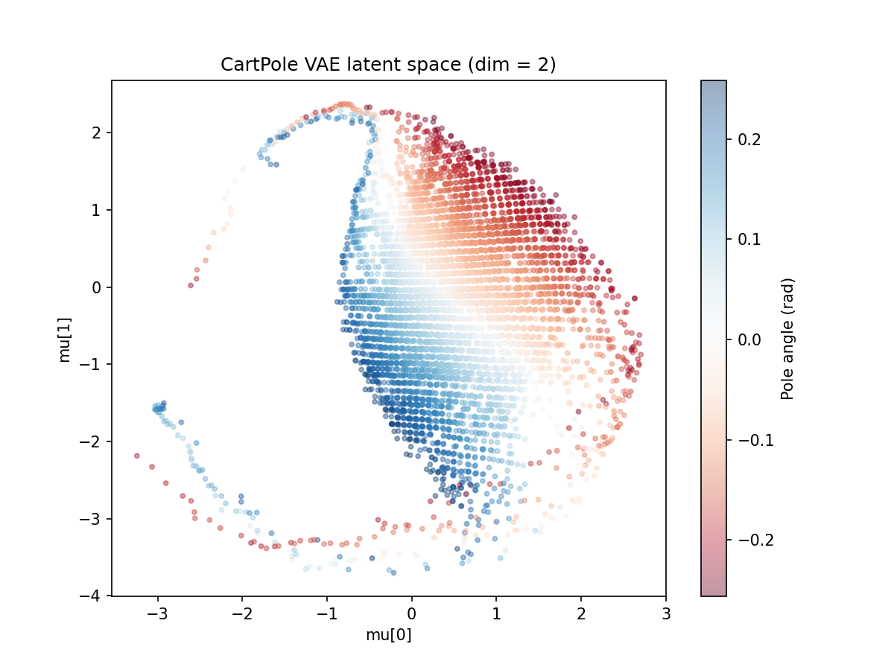
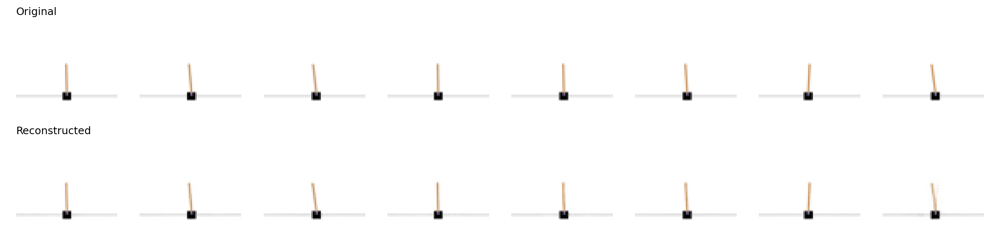

# CartPole On Latent Space
A Convolutional Variational Autoencoder (ConvVAE) trained on CartPole-v1 frames. The VAE learns to compress raw pixel observations into a compact 32-dimensional latent space — a key component of world model-based reinforcement learning agents.

## The latent space plot


## What I built

- ConvVAE: 3-layer convolutional encoder compresses 64×64 RGB frames into a 32-dim latent vector; decoder reconstructs the frame from that vector
- ReplayBuffer → collect_frames.py: 10,000 frames collected using random actions to cover the full state space (pole angles, cart positions)
- Trained with ELBO loss: BCE reconstruction + KL divergence regularization, 20 epochs, Adam lr=1e-3

## What the latent space plot shows
The VAE was never given pole angle as a label — it only saw raw pixel frames. Yet the latent space organized itself so that pole angle varies smoothly and continuously across the space. Red regions correspond to the pole leaning left, blue to the right, with a smooth gradient between them. This emergent structure is what makes the latent space useful for a world model: a transition model can learn to navigate it predictably.

## Result

| Metric              | Value        |
|---------------------|--------------|
| Minimum Loss        | 211.68       |
| Training epoch.     | 20           |
| Training time       | ~10 min (CPU)|


This shows that this vae can reconstruct the frames correctly.

## How to run

```bash
pip install -r requirements.txt
python collect_frames.py  # collect frames for training
python train.py           # train VAE network, save the weights
python grid.py            # compare Original vs VAE reconstruction
python latent_scatter.py. # plot the lattent space plot
```

## Project structure

```
.
+-- train.py   # VAE training loop
+-- vae.py     # define vae network
+-- collect_frames.py # collect frames
+-- grid.py # visualize vae reconstruction 
+-- latent_scatter.py # plot the latent space
+-- requirements.txt
+-- cartpole_frame/
+-- cartpole_latent.png
+-- cartpole_reconstructions.png
+-- vae_weights_latent2.pth # weights when latent_dim = 2
+-- vae_weights_latent32.pth # weights when latent_dim = 32
+-- README.md
```

## Connection to Phase 3
In Phase 3, a transition model will be trained to predict the next latent state zt+1z_{t+1}
zt+1​ given the current state ztz_t
zt​ and action ata_t
at​. By operating in this structured latent space rather than raw pixel space, the world model can learn environment dynamics efficiently — imagining future frames without ever rendering them.